# PV-Migration-System

Karmada 기반 StatefulSet PV 메타데이터 수집 및 수동 NFS PV 재생성 실험용 컨트롤러입니다.

이 저장소는 독립 Go 모듈 `github.com/GProjectdev/Karmada_with_PVMigration` 로 동작하며, controller-runtime `v0.21.0`, Kubernetes Go 라이브러리 `v0.33.4`, Go `1.24` 계열을 기준으로 합니다.

```mermaid
flowchart LR
  RB[Karmada StatefulSet / ResourceBinding] --> MD[PVMetadata + source PropagationPolicy]
  MD --> SYNC[Member PVSyncController]
  SYNC --> LOCAL[PVMetadata.status.volumes]
  LOCAL --> RIC[ResourceInterpreterCustomization]
  RIC --> SNAP[Karmada PVMetadata.status.clusters]
  SNAP --> MIG[PVMigrationController]
  MIG --> WORK[PV Work: preserveResourcesOnDeletion]
  WORK --> CLEAN[PVCleanupController]
  CLEAN --> PV[Work removed / PV retained]
```



`main` 브랜치의 루트에는 PV-Migration-System만 있습니다. Karmada 자체 소스와 vendor 트리는 포함하지 않습니다. Karmada는 별도로 설치한 환경을 사용합니다.

기존 Karmada 코드는 `Old_and_have_karmada` 브랜치에 보존됩니다. 일반 clone은 다른 브랜치의 이력도 내려받으므로, 용량을 줄이려면 아래처럼 `main`만 clone하세요.

```bash
git clone --single-branch --branch main https://github.com/GProjectdev/Karmada_with_PVMigration.git PV-Migration-System
cd PV-Migration-System
```

## 범위

- API: `migration.dcnlab.com/v1alpha1`
- 네임스페이스 리소스: `PVMetadata`, `PVMigration`
- 관리 컨트롤러: Karmada API만 사용
- 멤버 컨트롤러: 각 멤버 클러스터의 in-cluster ServiceAccount 사용
- 지원 PV: NFS + `Retain` 정책만

지원하지 않는 것:

- EBS, CSI, 클라우드 디스크 volumeHandle 마이그레이션
- 데이터 바이트 복사
- 소스 PVC/PV 자동 삭제
- ResourceBinding 자동 재개
- 타깃 클러스터가 이미 ResourceBinding 배치 대상에 들어간 상태의 사전 스테이징

## 공식 참고 링크

- Kubernetes CRD, status subresource, CEL validation: https://kubernetes.io/docs/tasks/extend-kubernetes/custom-resources/custom-resource-definitions/
- controller-runtime compatibility table: https://github.com/kubernetes-sigs/controller-runtime#compatibility
- Karmada ResourceInterpreterCustomization: https://karmada.io/docs/userguide/globalview/customizing-resource-interpreter/
- Karmada resource migration and `preserveResourcesOnDeletion`: https://karmada.io/docs/v1.14/tutorials/resource-migration/

## 전제 조건

두 kube context를 준비합니다.

- `host`: 관리 컨트롤러 Pod가 떠 있을 일반 Kubernetes 클러스터
- `karmada`: Karmada control plane API

멤버 클러스터 예시는 `aws` 라는 Karmada cluster 이름을 사용합니다. 실제 이름이 다르면 `config/member/deployment.yaml` 의 `--cluster-name=aws` 값을 패치하세요.

NFS 서버는 소스와 타깃 멤버 클러스터 모두에서 접근 가능해야 하며, PV reclaim policy는 `Retain` 이어야 합니다.

## 이미지 빌드와 푸시

```bash
cd PV-Migration-System
make docker-build IMG=ghcr.io/gprojectdev/pv-migration-system:dev
make docker-push IMG=ghcr.io/gprojectdev/pv-migration-system:dev
```

다른 레지스트리를 쓰면 Kustomize 이미지도 실제로 변경합니다.

```bash
(cd config/management && kustomize edit set image ghcr.io/gprojectdev/pv-migration-system=registry.example.com/pv-migration-system:v0.1.0)
(cd config/member && kustomize edit set image ghcr.io/gprojectdev/pv-migration-system=registry.example.com/pv-migration-system:v0.1.0)
```

이미 배포된 뒤라면 Deployment 이미지도 직접 바꿀 수 있습니다.

```bash
kubectl --context host -n pv-migration-system set image deployment/pv-migration-management manager=registry.example.com/pv-migration-system:v0.1.0
kubectl --context aws -n pv-migration-system set image deployment/pv-migration-member manager=registry.example.com/pv-migration-system:v0.1.0
```

## CRD 설치

CRD는 Karmada control plane과 멤버 클러스터 양쪽에 설치합니다.

```bash
kubectl --context karmada apply -k config/crd
kubectl --context aws apply -k config/crd
```

멤버가 여러 개면 모든 멤버에 적용합니다.

## Karmada RBAC와 RIC 설치

Karmada API에 별도로 RBAC와 ResourceInterpreterCustomization을 설치합니다.

```bash
kubectl --context karmada apply -k config/karmada/rbac
kubectl --context karmada apply -k config/karmada/ric
```

Karmada 쪽 ServiceAccount와 leader-election Lease namespace는 모두 `pv-migration-system` 으로 맞춥니다. `config/karmada/rbac` 는 이 namespace를 먼저 만들고 같은 namespace의 `pv-migration-management` ServiceAccount에 권한을 부여합니다.

`config/karmada/ric` 는 `PVMetadata` 의 local status만 반사하고, `AggregateStatus` 로 `status.clusters` 를 생성합니다. 새 관측값이 빠졌거나 ready가 아니거나 generation이 뒤처진 경우 마지막 정상 snapshot의 `volumes`, `workloadUID`, `collectedAt`, `observedGeneration` 을 함께 보존해서 오래된 데이터를 새 generation처럼 표시하지 않습니다.

## Karmada kubeconfig Secret

관리 컨트롤러는 host 클러스터에서 Pod로 실행되지만 Kubernetes client와 leader election lease는 Karmada kubeconfig만 사용합니다. `--kubeconfig` 는 management mode에서 명시적으로 전달해야 합니다.

운영 환경에서는 admin kubeconfig를 flatten 하지 말고 Karmada control plane 안에 전용 ServiceAccount를 만들고 `config/karmada/rbac` 권한만 부여한 kubeconfig를 Secret으로 넣는 것을 권장합니다. admin kubeconfig를 임시로 넣으면 토큰 자체는 admin 권한을 갖습니다. 이때 `config/karmada/rbac` 는 그 admin 토큰을 제한하지 못하며, 문서화된 최소 권한 참고용일 뿐입니다.

먼저 Karmada kubeconfig를 self-contained 형태로 flatten 합니다.

```bash
kubectl config view --context karmada --raw --flatten --minify > karmada.flattened.config
```

실제 credential이 들어간 파일은 절대 Git에 커밋하지 마세요. `.gitignore` 는 `*.config`, `*.kubeconfig`, key/cert/token류 파일을 제외합니다.

host 클러스터에 Secret을 만듭니다.

```bash
kubectl --context host -n pv-migration-system create namespace pv-migration-system --dry-run=client -o yaml | kubectl --context host apply -f -
kubectl --context host -n pv-migration-system create secret generic karmada-kubeconfig \
  --from-file=kubeconfig=./karmada.flattened.config \
  --dry-run=client -o yaml | kubectl --context host apply -f -
```

## 관리 컨트롤러 배포

```bash
kubectl --context host apply -k config/management
```

실행 명령은 다음 형태입니다. `--metrics-bind-address` 기본값은 `0` 이므로 manifest에서는 metrics를 열기 위해 `:8080` 을 명시합니다.

```bash
/manager --mode=management --kubeconfig=/etc/karmada/kubeconfig --health-probe-bind-address=:8081 --metrics-bind-address=:8080 --leader-election-namespace=pv-migration-system --poll-interval=15s --leader-elect=true
```

## 멤버 컨트롤러 배포

멤버 컨트롤러는 in-cluster ServiceAccount를 사용합니다. `aws` 멤버에 배포하는 예:

```bash
kubectl --context aws apply -k config/member
```

다른 cluster name을 쓰는 경우:

```bash
kubectl --context aws -n pv-migration-system patch deployment pv-migration-member \
  --type=json \
  -p='[{"op":"replace","path":"/spec/template/spec/containers/0/args/1","value":"--cluster-name=aws"}]'
```

실행 명령은 다음 형태입니다.

```bash
/manager --mode=member --cluster-name=aws --health-probe-bind-address=:8081 --metrics-bind-address=:8080 --leader-election-namespace=pv-migration-system --poll-interval=15s --leader-elect=true
```

## 워크로드 opt-in

StatefulSet을 대상으로 opt-in label을 붙입니다.

```bash
kubectl --context karmada -n default label statefulset web migration.dcnlab.com/pv-metadata=enabled
```

관리 컨트롤러는 opt-in StatefulSet의 ResourceBinding을 발견하고 workload/cluster 별 `PVMetadata` 와 source 고정 PropagationPolicy를 생성합니다. 이 source PP는 metadata object가 source 외 cluster로 이동하지 않게 하는 용도입니다. 실제 workload의 자동 failover나 scheduler 이동을 막지 않습니다.

상태 확인:

```bash
kubectl --context karmada -n default get pvmetadata \
  -o custom-columns=NAME:.metadata.name,SOURCE:.spec.sourceCluster,WORKLOAD:.spec.workloadRef.name,READY:.status.clusters[0].ready

PV_METADATA=$(kubectl --context karmada -n default get pvmetadata -o jsonpath='{range .items[?(@.spec.sourceCluster=="member1")]}{.metadata.name}{"\t"}{.spec.workloadRef.name}{"\n"}{end}' | awk '$2=="web" {print $1; exit}')
kubectl --context karmada -n default get pvmetadata "$PV_METADATA" -o yaml
```

`status.clusters[*].volumes[*]` 에 PVC, PV, templateName, ordinal, native PV spec이 보존되어야 합니다. source cluster가 일시적으로 offline이거나 `ready=false` 여도 마지막 정상 snapshot을 migration 입력으로 사용할 수 있지만, volumes와 coherent snapshot generation이 있어야 합니다.

## 마이그레이션 절차

마이그레이션은 명시적 수동 요청입니다. 시작 전 운영 의무:

1. StatefulSet ResourceBinding 이름을 먼저 찾습니다. Karmada에서는 이름이 `web` 이 아니라 `web-statefulset` 처럼 생성될 수 있습니다.
2. StatefulSet ResourceBinding dispatch를 `suspension=true` 로 중단합니다.
3. stock workload failover나 scheduler movement를 비활성화합니다. source 고정 metadata PP는 workload 이동을 막지 않습니다.
4. placement 변경 전에 source workload를 정지하거나 fence 합니다. 수동 fence 예시는 source를 scale 0으로 낮추되 마지막 PVMetadata snapshot은 보존하는 것입니다.
5. 원본 PV의 `persistentVolumeReclaimPolicy`와 StatefulSet의 PVC retention 정책이 `Retain`인지 확인합니다. 특히 scale-down 전에 `persistentVolumeClaimRetentionPolicy.whenScaled`를 확인합니다.
6. `sourceFenced=true` 는 시스템이 직접 검증한 값이 아니라 운영자가 source fence 완료를 증명하는 attestation입니다.
7. old PV controller나 suspension을 자동 해제하는 controller는 이 실험 범위에서 비활성화합니다.
8. 타깃 클러스터가 ResourceBinding의 clusters 목록에 없어야 합니다.

ResourceBinding 이름 찾기 예:

```bash
kubectl --context karmada -n default get resourcebinding \
  -o jsonpath='{range .items[*]}{.metadata.name}{"\t"}{.spec.resource.kind}{"\t"}{.spec.resource.name}{"\n"}{end}'

RB_NAME=$(kubectl --context karmada -n default get resourcebinding -o jsonpath='{range .items[*]}{.metadata.name}{"\t"}{.spec.resource.kind}{"\t"}{.spec.resource.name}{"\n"}{end}' | awk '$2=="StatefulSet" && $3=="web" {print $1; exit}')
```

ResourceBinding 중단 예:

```bash
kubectl --context karmada -n default patch resourcebinding "$RB_NAME" \
  --type=merge \
  -p='{"spec":{"suspension":{"dispatching":true}}}'
```

source fence는 이 시스템 밖의 운영 책임입니다. 완료했다고 확인한 뒤에만 로컬 복사본에서 `sourceFenced=true` 로 바꿔 생성합니다. CR spec은 immutable이므로 만든 뒤 patch하는 흐름이 아니라, 생성 전에 sample을 패치해야 합니다.

```bash
PATCH=$(printf '{"spec":{"metadataRef":"%s","resourceBinding":"%s","sourceFenced":true}}' "$PV_METADATA" "$RB_NAME")
kubectl patch --local -f config/samples/pvmigration.yaml --type=merge \
  -p "$PATCH" \
  -o yaml > /tmp/pvmigration.ready.yaml
kubectl --context karmada -n default apply -f /tmp/pvmigration.ready.yaml
```

예시 요청은 source `member1`, target `aws` 입니다.

```yaml
spec:
  metadataRef: pvm-<hash>
  sourceCluster: member1
  targetCluster: aws
  resourceBinding: web-statefulset
  sourceFenced: true
  volumes:
    - sourcePVC: data-web-0
      targetPVC: data-web-0
```

replica ordinal 매핑은 PVC 이름으로 명시합니다. 예를 들어 `data-web-0`, `data-web-1` 처럼 각 ordinal PVC를 전부 적어야 합니다.

컨트롤러는 요청된 target ordinal마다 claim-template 매핑이 빠짐없이 있는지 검증합니다. 계획이 확정되면 generated Work spec과 source-local workloadUID, PVC UID, PV 이름을 해시해 `status.planHash` 에 기록합니다. `collectedAt` 은 poll마다 바뀌므로 해시에 포함하지 않습니다. planning 이후 snapshot identity나 PV spec이 바뀌면 같은 요청을 조용히 다른 계획으로 바꾸지 않고 거부해야 합니다.

## 완료 의미

```bash
kubectl --context karmada -n default get pvmigration web-member1-to-aws -o yaml
```

`status.phase=Completed` 의 의미는 제한적입니다.

- 타깃에 retained NFS PV Work가 적용됨
- 반사된 PV가 identity check를 통과하고 `Available` 또는 `Bound` 로 관측됨
- Karmada v1.14에서 Work `Applied` condition의 observedGeneration이 없거나 `0` 일 수 있으므로, generation `<=1` create-once immutable Work에 한해 이를 허용함
- durable status에 `applied=true` 를 남긴 뒤 Work를 detach함
- PV는 유지됨

`Completed` 는 애플리케이션 복구, 데이터 복사, 트래픽 전환, ResourceBinding 재개를 뜻하지 않습니다.

완료된 `PVMigration` CR은 target PVC 중복 예약 기록이자 migration history입니다. 컨트롤러가 자동으로 pruning하면 안 되며, 정리는 운영자가 명시적으로 결정해야 합니다.

checkpoint/restore gate가 외부에서 통과한 뒤에만 target PropagationPolicy를 업데이트하고 ResourceBinding dispatch를 재개하세요.

```bash
kubectl --context karmada -n default patch propagationpolicy web-pp \
  --type=merge \
  -p='{"spec":{"placement":{"clusterAffinity":{"clusterNames":["aws"]}}}}'

kubectl --context karmada -n default patch resourcebinding "$RB_NAME" \
  --type=merge \
  -p='{"spec":{"suspension":{"dispatching":null}}}'
```

## 기존 타깃 사전 스테이징 제한

Stateful-Migration-System과 함께 사용할 때는 위 수동 재개 대신
[Suspension 게이트](https://github.com/GProjectdev/Stateful-Migration-Operator-with-PV/blob/main/docs/suspension.md)와
[StatefulSet 2 Pod 통합 가이드](https://github.com/GProjectdev/Stateful-Migration-Operator-with-PV/blob/main/docs/two-replica-migration-guide.md)를 따르세요.
Karmada의 dispatching은 true만 허용하므로 수동 해제 예제도 false가 아닌 필드 제거(null)를 사용합니다.

새 게이트는 현재 PVMigration UID, observedGeneration, Completed, 비어 있지 않은 planHash,
전체 volumes에 대응하는 applied/detached Work 기록 및 source/target/RB/workload UID/PVC 매핑을 확인합니다.
이 PV 컨트롤러 자체는 ResourceBinding을 재개하지 않습니다.
Completed는 과거에 확정된 준비 기록이며 현재 NFS 상태나 애플리케이션 복구를 증명하지 않습니다.
기존 annotation만 검사하는 suspension 컨트롤러는 중지하고, 새 게이트와 수동 해제를 동시에 사용하지 마세요.

stock Karmada 환경에서 타깃 cluster가 이미 ResourceBinding placement에 있으면 Karmada가 workload resource를 먼저 dispatch할 수 있습니다. 그러면 이 컨트롤러가 만드는 retained PV Work와 StatefulSet/PVC 생성 순서가 경쟁합니다.

따라서 이 범위에서는 target이 ResourceBinding clusters에 없는 상태에서만 migration을 허용합니다. 기존 target pre-staging을 해야 한다면 별도의 checkpoint gate, PVC 바인딩 제어, workload dispatch 순서 제어가 필요합니다.

## 검증 및 운영 확인

`go test ./...`, `go vet ./...`, `make build`, `make manifests`로 로컬 검증을 재현합니다. 검증 범위와 실제 클러스터 확인 항목은 [docs/validation.md](docs/validation.md)에 있습니다.

진행 중인 `PVMigration` 삭제는 취소 API가 아닙니다. `Completed` 이전에 삭제하면 소유자 참조가 없는 PV Work가 남을 수 있습니다. 요청과 Work의 상태를 확인한 뒤 복구해야 하며, Work 정리 시 `preserveResourcesOnDeletion=true`를 유지해야 합니다. 이 컨트롤러는 PV/PVC 삭제나 원본 데이터를 정리하지 않습니다.
